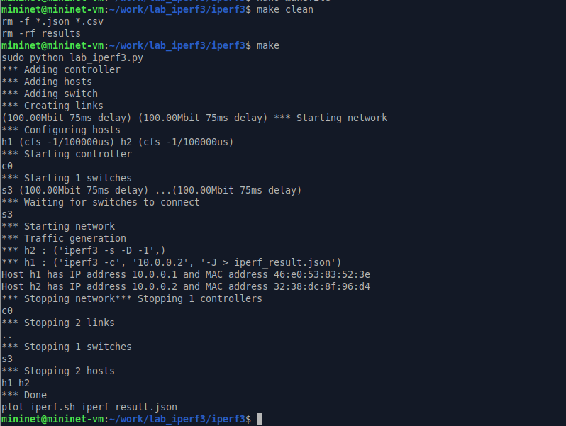

---
## Front matter
lang: ru-RU
title: Лабораторная работа 3
author:
  - Петрушов Дмитрий, 1032212287
institute:
  - Российский университет дружбы народов, Москва, Россия
date: "2024"

## i18n babel
babel-lang: russian
babel-otherlangs: english

## Formatting pdf
toc: false
toc-title: Содержание
slide_level: 2
aspectratio: 169
section-titles: true
theme: metropolis
header-includes:
 - \metroset{progressbar=frametitle,sectionpage=progressbar,numbering=fraction}
 - '\makeatletter'
 - '\beamer@ignorenonframefalse'
 - '\makeatother'
---

# Выполнение

## Загрузка всего нужного

{#fig:001 width=70%}

## Внесение изменений в скрипт

{#fig:002 width=70%}

## Проверка

{#fig:003 width=70%}

## Внесение изменений в файл lab_iperf3.py

{#fig:004 width=70%}

## Написание Makefile

{#fig:005 width=70%}

## Проверка

{#fig:006 width=70%}

## Вывод

Мы познакомились с инструментом для измерения пропускной способности сети в режиме реального времни - iperf3, а также получили навыки проведения воспроизводимого эксперимента по измерению пропускной способности моделируемой сери в среде Mininet.
