---
## Front matter
title: "Лабораторная работа 3"
author: "Петрушов Дмитрий, 1032212287"

## Generic otions
lang: ru-RU
toc-title: "Содержание"

## Bibliography
bibliography: bib/cite.bib
csl: pandoc/csl/gost-r-7-0-5-2008-numeric.csl

## Pdf output format
toc: true # Table of contents
toc-depth: 2
lof: true # List of figures
lot: true # List of tables
fontsize: 12pt
linestretch: 1.5
papersize: a4
documentclass: scrreprt
## I18n polyglossia
polyglossia-lang:
  name: russian
  options:
	- spelling=modern
	- babelshorthands=true
polyglossia-otherlangs:
  name: english
## I18n babel
babel-lang: russian
babel-otherlangs: english
## Fonts
mainfont: PT Serif
romanfont: PT Serif
sansfont: PT Sans
monofont: PT Mono
mainfontoptions: Ligatures=TeX
romanfontoptions: Ligatures=TeX
sansfontoptions: Ligatures=TeX,Scale=MatchLowercase
monofontoptions: Scale=MatchLowercase,Scale=0.9
## Biblatex
biblatex: true
biblio-style: "gost-numeric"
biblatexoptions:
  - parentracker=true
  - backend=biber
  - hyperref=auto
  - language=auto
  - autolang=other*
  - citestyle=gost-numeric
## Pandoc-crossref LaTeX customization
figureTitle: "Рис."
tableTitle: "Таблица"
listingTitle: "Листинг"
lofTitle: "Список иллюстраций"
lotTitle: "Список таблиц"
lolTitle: "Листинги"
## Misc options
indent: true
header-includes:
  - \usepackage{indentfirst}
  - \usepackage{float} # keep figures where there are in the text
  - \floatplacement{figure}{H} # keep figures where there are in the text
---
# Цель работы

Основной целью работы является знакомство с инструментом для измерения пропускной способности 
сети в режиме реального времени — iPerf3, а также получение навыков проведения воспроизводимого 
эксперимента по измерению пропускной способности моделируемой сети в среде Mininet.

# Выполнение лабораторной работы

С помощью API Mininet создадим простейшую топологию сети, состоящую из двух хостов и коммутатора 
с назначенной по умолчанию mininet сетью 10.0.0.0/8. Для этого в каталоге /work/lab_iperf3 для 
работы над проектом создадим подкаталог lab_iperf3_topo и скопируем в него файл с примером скрипта
mininet/examples/emptynet.py, описывающего стандартную простую топологию сети mininet (рис. [-@fig:001]):

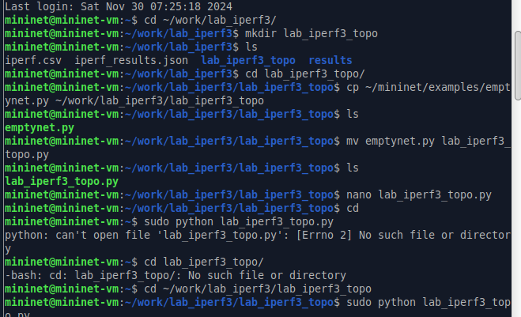{ #fig:001 width=100% height=100% }

Следующим шагом внесём в скрипт lab_iperf3_topo.py изменение, позволяющее вывести на экран 
информацию о хосте h1, а именно имя хоста, его IP-адрес, MAC-адрес. Для этого после строки, 
задающей старт работы сети, добавим нужную строку (рис. [-@fig:002]):

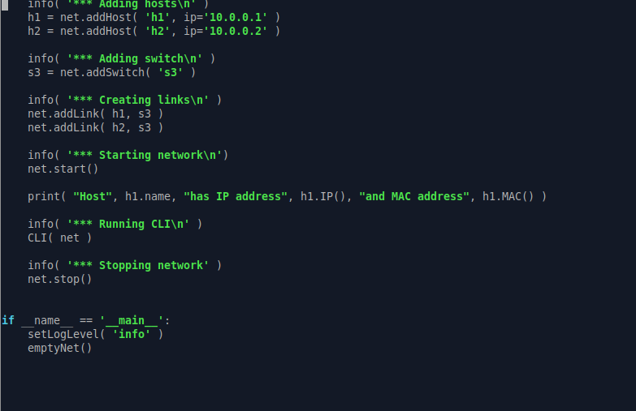{ #fig:002 width=100% height=100% }

Проверим корректность отработки изменённого скрипта (рис. [-@fig:003]):

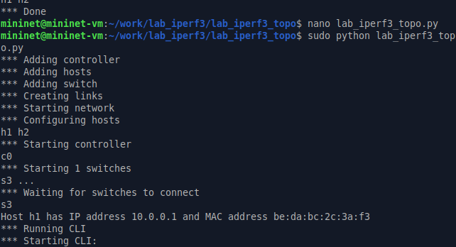{ #fig:003 width=100% height=100% }

Затем изменим скрипт lab_iperf3_topo.py так, чтобы на экран выводилась информация об имени, 
IP-адресе и MAC-адресе обоих хостов сети и проверим корректность отработки изменённого скрипта (рис. [-@fig:004] - рис. [-@fig:005]):

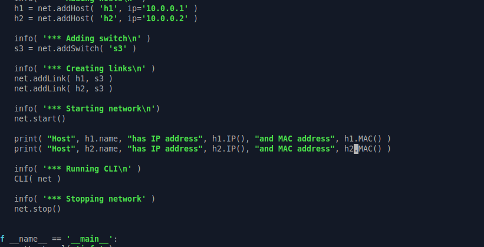{ #fig:004 width=100% height=100% }

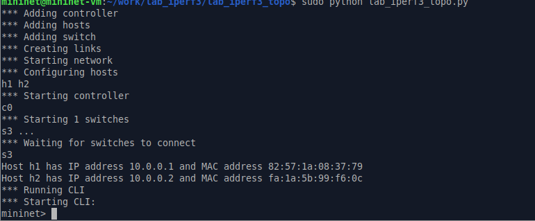{ #fig:005 width=100% height=100% }

Mininet предоставляет функции ограничения производительности и изоляции с помощью классов 
CPULimitedHost и TCLink. Добавим в скрипт настройки параметров производительности. Для начала
сделаем копию скрипта lab_iperf3_topo.py:

В начале скрипта lab_iperf3_topo2.py добавим записи об импорте классов CPULimitedHost и TCLink. 
Далее изменим строку описания сети, указав на использование ограничения производительности и изоляции.
Следующим шагом изменим функцию задания параметров виртуального хоста h1, указав, что ему 
будет выделено 50% от общих ресурсов процессора системы. Аналогичным образом для хоста h2 зададим долю выделения ресурсов
процессора в 50%. В конце изменим функцию параметров соединения между хостом h1 и коммутатором s3 (рис. [-@fig:006]):

{ #fig:006 width=100% height=100% }

Запустим на отработку скрипт lab_iperf3_topo2.py (рис. [-@fig:007] - рис. [-@fig:008]):

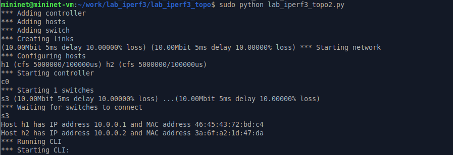{ #fig:007 width=100% height=100% }
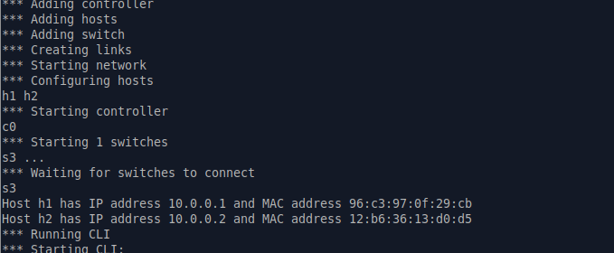{ #fig:008 width=100% height=100% }

Перед завершением лабораторной работы, построим графики по проводимому эксперименту. 
Для этого сделаем копию скрипта lab_iperf3_topo2.py и поместим его в подкаталог iperf
В начале скрипта lab_iperf3.py добавим запись об импорте time и изменим код в скрипте так, чтобы
- на хостах не было ограничения по использованию ресурсов процессора;
- каналы между хостами и коммутатором были по 100 Мбит/с с задержкой 75 мс, без потерь, без использования ограничителей пропускной
способности и максимального размера очереди

После функции старта сети опишим запуск на хосте h2 сервера iPerf3, а на хосте h1 запуск 
с задержкой в 10 секунд клиента iPerf3 с экспортом результатов в JSON-файл, 
закомментируем строки, отвечающие за запуск CLI-интерфейса (рис. [-@fig:009]):

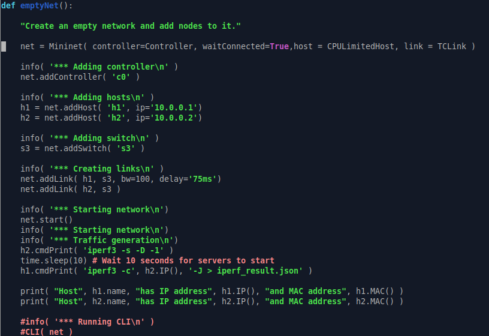{ #fig:009 width=100% height=100% }

Запустим на отработку скрипт lab_iperf3.py (рис. [-@fig:010]):

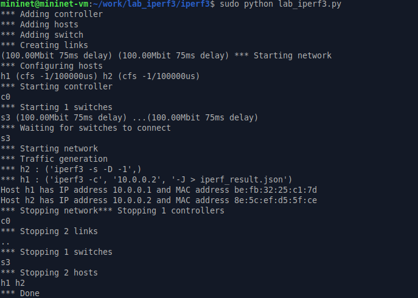{ #fig:010 width=100% height=100% }

Построим графики из получившегося JSON-файла и создадим Makefile для проведения всего эксперимента:

В Makefile пропишим запуск скрипта эксперимента, построение графиков и очистку каталога от результатов (рис. [-@fig:011]):

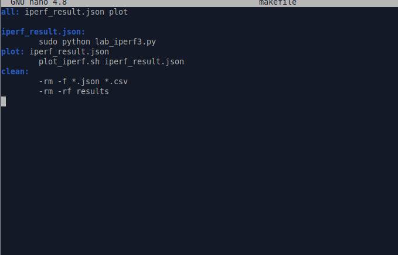{ #fig:011 width=100% height=100% }

Проверим корректность отработки Makefile (рис. [-@fig:012]):

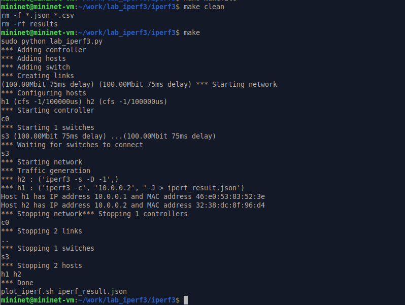{ #fig:012 width=100% height=100% }

# Вывод

В ходе выполнения лабораторной работы познакомились с инструментом для измерения пропускной способности 
сети в режиме реального времени — iPerf3, а также получили навыки проведения воспроизводимого 
эксперимента по измерению пропускной способности моделируемой сети в среде Mininet

# Список литературы{.unnumbered}

::: {#refs}
:::
