---
## Front matter
lang: ru-RU
title: Лабораторная работа 4
author:
  - Петрушов Дмитрий Сергеевич 1032212287
institute:
  - Российский университет дружбы народов, Москва, Россия
date: 2024

## i18n babel
babel-lang: russian
babel-otherlangs: english

## Formatting pdf
toc: false
toc-title: Содержание
slide_level: 2
aspectratio: 169
section-titles: true
theme: metropolis
header-includes:
 - \metroset{progressbar=frametitle,sectionpage=progressbar,numbering=fraction}
 - '\makeatletter'
 - '\beamer@ignorenonframefalse'
 - '\makeatother'
---

# Цель работы

Основной целью работы является знакомство с NETEM — инструментом для тестирования 
производительности приложений в виртуальной сети, а также получение навыков проведения 
интерактивного и воспроизводимого экспериментов по измерению задержки и её дрожания (jitter) 
в моделируемой сети в среде Mininet.  

# Выполнение работы

 ## Начало выполнения

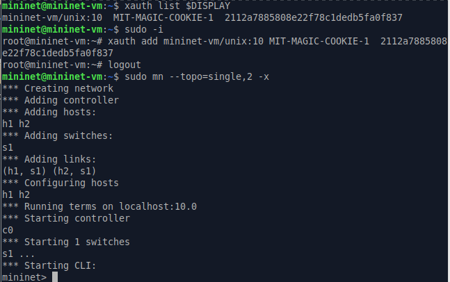{#fig:001 width=70%}

 ## Начало выполнения  

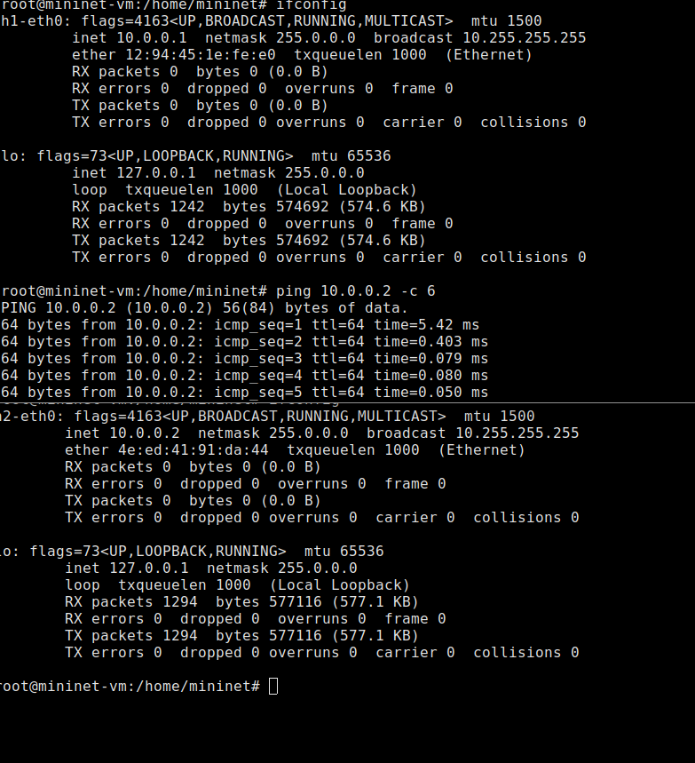{#fig:002 width=70%}

## Добавление первого правила на h1  

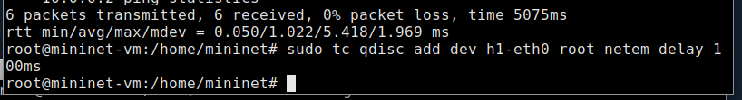{#fig:003 width=70%}

## Проверка  

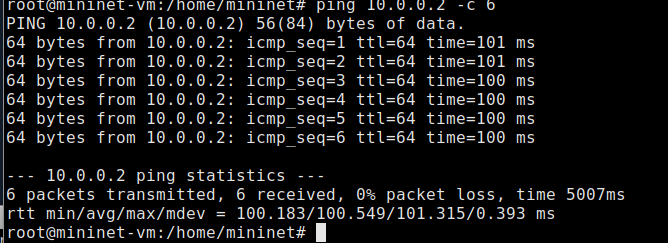{#fig:004 width=70%}  

## Добавление правила на h2

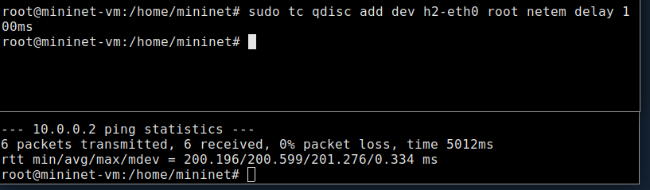{#fig:005 width=70%}

## Изменение задержки со 100 мс до 50 мс  

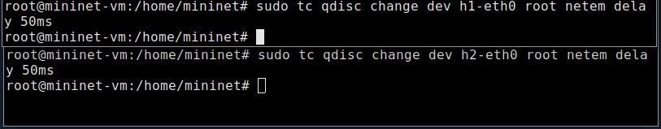{#fig:006 width=70%}

## Изменение задержки со 100 мс до 50 мс

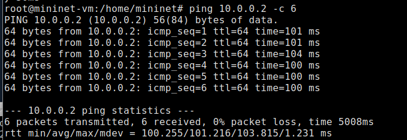{#fig:006 width=70%}

## Восстановление конфигурации по умолчанию

 {#fig:007 width=70%}

## Добавление на узле h1 задержки в 100 мс со случайным отклонением 10 мс

[Добавление на узле h1 задержки в 100 мс со случайным отклонением 10 мс и проверка](image/11.png){#fig:008 width=70%}

## Добавим на интерфейсе хоста h1 задержку в 100 мс с вариацией ±10 мс и значением корреляции в 25%

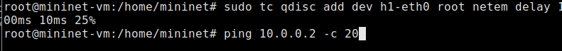{#fig:009 width=70%}

## Добавим на интерфейсе хоста h1 задержку в 100 мс с вариацией ±10 мс и значением корреляции в 25%

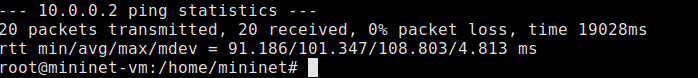{#fig:010 width=70%}

## Настройка нормального распределения задержки на узле h1

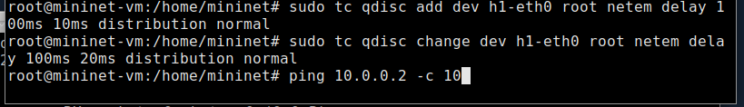{#fig:011 width=70%}

## Настройка нормального распределения задержки на узле h1

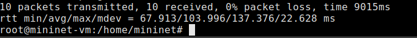{#fig:012 width=70%}

## Последующая работа

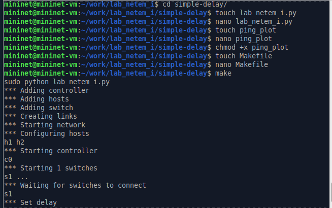{#fig:013 width=70%}

## Последующая работа

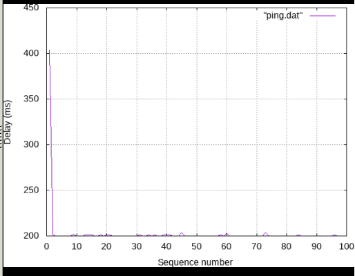{#fig:014 width=70%}

## Последующая работа

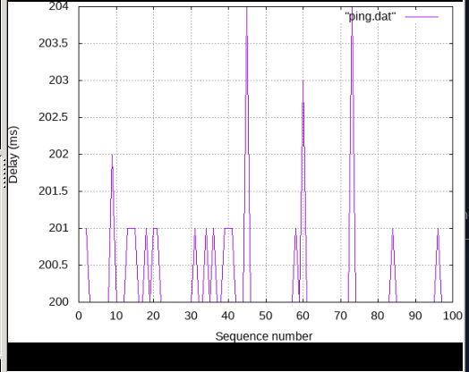{#fig:015 width=70%}

## Вывод

 В ходе выполнения лабораторной работы познакомились с NETEM — инструментом для тестирования 
производительности приложений в виртуальной сети, а также получили навыки проведения 
интерактивного и воспроизводимого экспериментов по измерению задержки и её дрожания (jitter) 
в моделируемой сети в среде Mininet.
