---
## Front matter
lang: ru-RU
title: Лабораторная работа 5
author:
  - Петрушов Дмитрий Сергеевич 1032212287
institute:
  - Российский университет дружбы народов, Москва, Россия
date: 2024

## i18n babel
babel-lang: russian
babel-otherlangs: english

## Formatting pdf
toc: false
toc-title: Содержание
slide_level: 2
aspectratio: 169
section-titles: true
theme: metropolis
header-includes:
 - \metroset{progressbar=frametitle,sectionpage=progressbar,numbering=fraction}
 - '\makeatletter'
 - '\beamer@ignorenonframefalse'
 - '\makeatother'
---

# Цель работы

  Основной целью работы является получение навыков проведения интерактивных экспериментов в среде 
Mininet по исследованию параметров сети, связанных с потерей, дублированием, изменением порядка 
и повреждением пакетов при передаче данных. Эти параметры влияют на производительность протоколов и сетей.

# Выполнение работы

## Начало выполнения

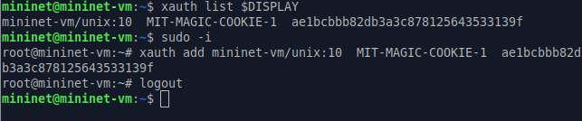{ #fig:001 width=100% height=100% }

## Начало выполнения  

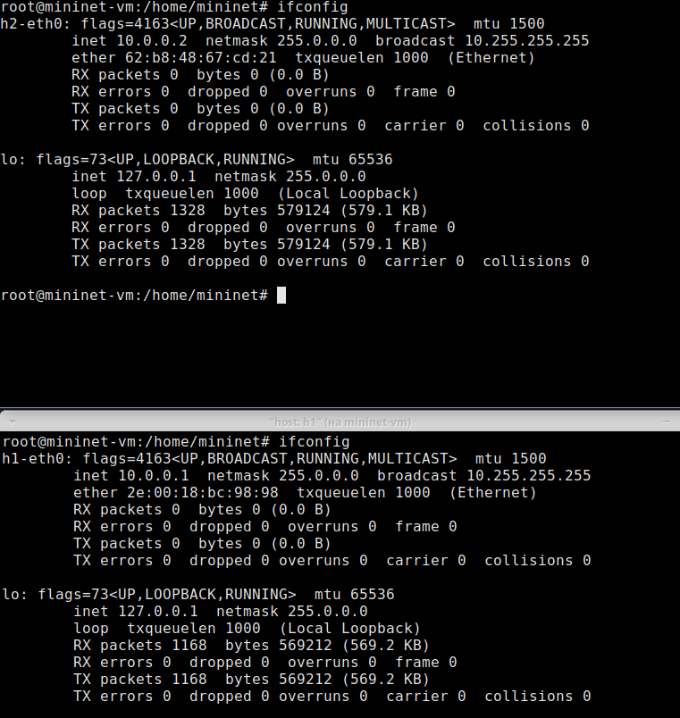{ #fig:002 width=100% height=100% }

## Добавление первого правила на h1  

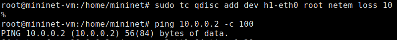{ #fig:003 width=100% height=100% }

## Проверка  

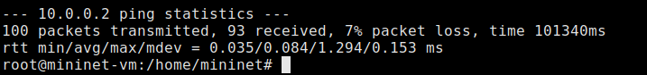{ #fig:004 width=100% height=100% }

## Добавление правила на h2

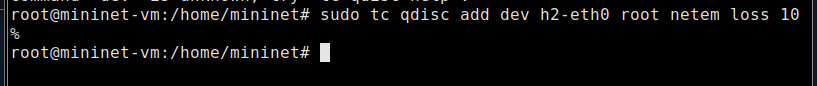{ #fig:005 width=100% height=100% }

## Проверка 

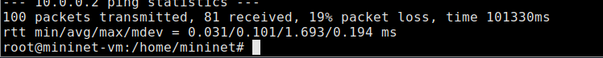{ #fig:006 width=100% height=100% }

## Добавление на узле h1 коэффициента потери пакетов 50%

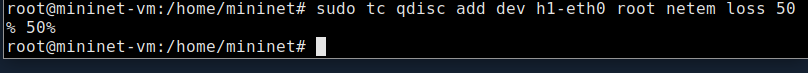{ #fig:007 width=100% height=100% }

## Проверка

{ #fig:008 width=100% height=100% }

## Добавление на узле h1 0.01% повреждения пакетов

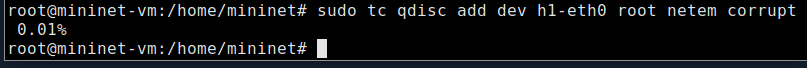{ #fig:009 width=100% height=100% }

## Проверка конфигурации с помощью инструмента iPerf3 для проверки повторных передач

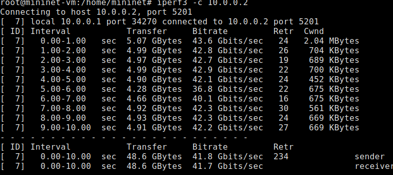{ #fig:010 width=100% height=100% }

## Добавление на узле h1 нового правила

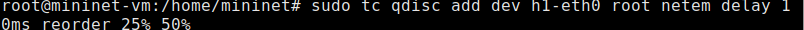{ #fig:011 width=100% height=100% }

## Проверка

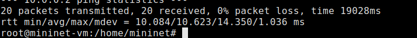{ #fig:012 width=100% height=100% }

## Добавление на узле h1 правила с дублированием 50% пакетов

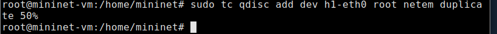{ #fig:013 width=100% height=100% }

## Проверка

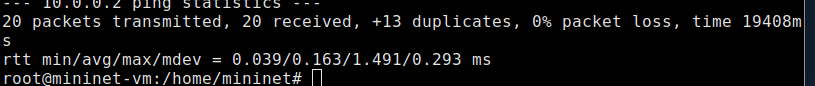{ #fig:014 width=100% height=100% }

## Последующая работа

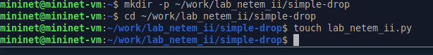{ #fig:014 width=100% height=100% }

## Последующая работа

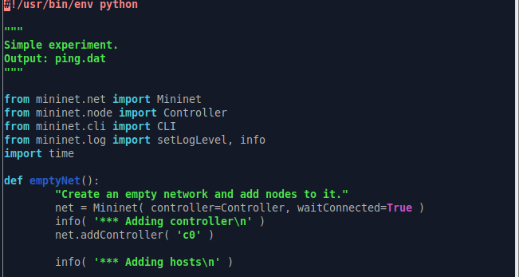{ #fig:015 width=100% height=100% }

## Последующая работа

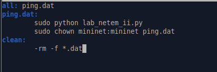{ #fig:016 width=100% height=100% }

## Вывод

В ходе выполнения лабораторной работы получили навыки проведения интерактивных экспериментов в 
среде Mininet по исследованию параметров сети, связанных с потерей, дублированием, изменением порядка 
и повреждением пакетов при передаче данных.