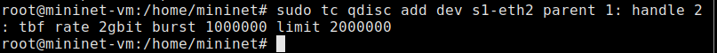

---
## Front matter
lang: ru-RU
title: Лабораторная работа 6
author:
  - Петрушов Дмитрий Сергеевич 1032212287
institute:
  - Российский университет дружбы народов, Москва, Россия
date: 2024

## i18n babel
babel-lang: russian
babel-otherlangs: english

## Formatting pdf
toc: false
toc-title: Содержание
slide_level: 2
aspectratio: 169
section-titles: true
theme: metropolis
header-includes:
 - \metroset{progressbar=frametitle,sectionpage=progressbar,numbering=fraction}
 - '\makeatletter'
 - '\beamer@ignorenonframefalse'
 - '\makeatother'
---

# Цель работы

Основной целью работы является знакомство с принципами работы дисциплины очереди Token Bucket Filter, которая 
формирует входящий/исходящий трафик для ограничения пропускной способности, а также получение навыков моделирования и 
исследования поведения трафика посредством проведения интерактивного и воспроизводимого экспериментов в Mininet.

# Выполнение работы

## Создание топологии с двумя хостами и двумя коммутаторами

{ #fig:001 width=100% height=100% }

## Проверка подключения

{ #fig:002 width=100% height=100% }

## Изменение пропускной способности 

{ #fig:003 width=100% height=100% }

## Проверка

[Запуск iPerf3 в режиме клиента на хосте h1](image/6.png){ #fig:004 width=100% height=100% }

## ограничения скорости tbf

{ #fig:005 width=100% height=100% }

## Проверка

{ #fig:006 width=100% height=100% }

## Объединение NETEM и TBF

{ #fig:007 width=100% height=100% }

## Проверка

{ #fig:008 width=100% height=100% }

## Добавление второго правила

{ #fig:009 width=100% height=100% }

## Проверка

{ #fig:010 width=100% height=100% }

## Самостоятельная работа

{ #fig:011 width=100% height=100% }

## Самостоятельная работа

{ #fig:012 width=100% height=100% }

# Вывод

В ходе выполнения лабораторной работы познакомились с принципами работы дисциплины очереди Token Bucket Filter, которая 
формирует входящий/исходящий трафик для ограничения пропускной способности, а также получили навыки моделирования и 
исследования поведения трафика посредством проведения интерактивного и воспроизводимого экспериментов в Mininet.

