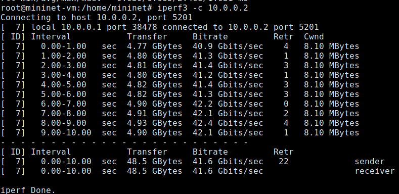

---
## Front matter
title: "Отчет по лабораторной работе 6"
author: "Петрушов Дмитрий, 1032212287"

## Generic otions
lang: ru-RU
toc-title: "Содержание"

## Bibliography
bibliography: bib/cite.bib
csl: pandoc/csl/gost-r-7-0-5-2008-numeric.csl

## Pdf output format
toc: true # Table of contents
toc-depth: 2
lof: true # List of figures
lot: true # List of tables
fontsize: 12pt
linestretch: 1.5
papersize: a4
documentclass: scrreprt
## I18n polyglossia
polyglossia-lang:
  name: russian
  options:
	- spelling=modern
	- babelshorthands=true
polyglossia-otherlangs:
  name: english
## I18n babel
babel-lang: russian
babel-otherlangs: english
## Fonts
mainfont: PT Serif
romanfont: PT Serif
sansfont: PT Sans
monofont: PT Mono
mainfontoptions: Ligatures=TeX
romanfontoptions: Ligatures=TeX
sansfontoptions: Ligatures=TeX,Scale=MatchLowercase
monofontoptions: Scale=MatchLowercase,Scale=0.9
## Biblatex
biblatex: true
biblio-style: "gost-numeric"
biblatexoptions:
  - parentracker=true
  - backend=biber
  - hyperref=auto
  - language=auto
  - autolang=other*
  - citestyle=gost-numeric
## Pandoc-crossref LaTeX customization
figureTitle: "Рис."
tableTitle: "Таблица"
listingTitle: "Листинг"
lofTitle: "Список иллюстраций"
lotTitle: "Список таблиц"
lolTitle: "Листинги"
## Misc options
indent: true
header-includes:
  - \usepackage{indentfirst}
  - \usepackage{float} # keep figures where there are in the text
  - \floatplacement{figure}{H} # keep figures where there are in the text
---

# Цель работы

Основной целью работы является знакомство с принципами работы дисциплины очереди Token Bucket Filter, которая 
формирует входящий/исходящий трафик для ограничения пропускной способности, а также получение навыков моделирования и 
исследования поведения трафика посредством проведения интерактивного и воспроизводимого экспериментов в Mininet.

# Выполнение лабораторной работы

В виртуальной машине mininet исправим права запуска X-соединения

Зададим топологию сети, состоящую из двух хостов и двух коммутаторов с назначенной по умолчанию 
mininet сетью 10.0.0.0/8 (рис. [-@fig:001]):

{ #fig:001 width=100% height=100% }

На хостах h1, h2 и на коммутаторах s1, s2 введём команду ifconfig, чтобы отобразить информацию, 
относящуюся к их сетевым интерфейсам и назначенным им IP-адресам. В дальнейшем при работе с NETEM 
и командой tc будем использовать интерфейсы h1-eth0, h2-eth0, s1-eth2 (рис. [-@fig:002]):

{ #fig:002 width=100% height=100% }

Проверим подключение между хостами h1 и h2 с помощью команды ping с параметром -c 4 (рис. [-@fig:003]):

{ #fig:003 width=100% height=100% }

В терминале хоста h2 запустим iPerf3 в режиме сервера

В терминале хоста h1 запустим iPerf3 в режиме клиента (рис. [-@fig:004]):

{ #fig:004 width=100% height=100% }

После завершения работы iPerf3 на хосте h1 остановим iPerf3 на хосте h2, нажав Ctrl + c.

Команду tc можно применить к сетевому интерфейсу устройства для формирования исходящего трафика. Требуется ограничить 
скорость отправки данных с конечного хоста с помощью фильтра Token Bucket Filter (tbf).

Изменим пропускную способность хоста h1, установив пропускную способность на 10 Гбит/с на интерфейсе 
h1-eth0 и параметры TBF-фильтра (рис. [-@fig:005]):

{ #fig:005 width=100% height=100% }

С помощью iPerf3 проверим, что значение пропускной способности изменилось.

В терминале хоста h2 запустим iPerf3 в режиме сервера.

В терминале хоста h1 запустим iPerf3 в режиме клиента (рис. [-@fig:006]):

{ #fig:006 width=100% height=100% }

После завершения работы iPerf3 на хосте h1 остановим iPerf3 на хосте h2, нажав Ctrl + c.

Удалим модифицированную конфигурацию на хосте h1.

Применим правило ограничения скорости tbf с параметрами rate = 10gbit, burst = 5,000,000, 
limit= 15,000,000 к интерфейсу s1-eth2 коммутатора s1, который соединяет его с коммутатором s2 (рис. [-@fig:007]):

{ #fig:007 width=100% height=100% }

Проверим конфигурацию с помощью инструмента iperf3 для измерения пропускной способности.

В терминале хоста h2 запустим iPerf3 в режиме сервера.

В терминале хоста h1 запустим iPerf3 в режиме клиента (рис. [-@fig:008]):

{ #fig:008 width=100% height=100% }

После завершения работы iPerf3 на хосте h1 остановим iPerf3 на хосте h2, нажав Ctrl + c.

Удалим модифицированную конфигурацию на коммутаторе s1.

NETEM используется для изменения задержки, джиттера, повреждения пакетов и т.д. TBF может использоваться для ограничения 
скорости. Утилита tc позволяет комбинировать несколько модулей. При этом первая дисциплина очереди (qdisc1) 
присоединяется к корневой метке, последующие дисциплины очереди можно прикрепить к своим родителям, указав правильную метку.

Объединим NETEM и TBF, введя на интерфейсе s1-eth2 коммутатора s1 задержку, джиттер, повреждение пакетов и указав скорость (рис. [-@fig:009]):

{ #fig:009 width=100% height=100% }

Убедимся, что соединение от хоста h1 к хосту h2 имеет заданную задержку. Для этого запустим 
команду ping с параметром -c 4 с терминала хоста h1 (рис. [-@fig:010]):

{ #fig:010 width=100% height=100% }

Добавим второе правило на коммутаторе s1, которое задаёт ограничение скорости с помощью tbf с параметрами rate=2gbit, 
burst=1,000,000, limit=2,000,000 (рис. [-@fig:011]):

{ #fig:011 width=100% height=100% }

Проверим конфигурацию с помощью инструмента iperf3 для измерения пропускной способности.

В терминале хоста h2 запустим iPerf3 в режиме сервера.

В терминале хоста h1 запустим iPerf3 в режиме клиента (рис. [-@fig:012]):

{ #fig:012 width=100% height=100% }

После завершения работы iPerf3 на хосте h1 остановим iPerf3 на хосте h2, нажав Ctrl + c.

Удалим модифицированную конфигурацию на коммутаторе s1 (рис. [-@fig:013]):

{ #fig:013 width=100% height=100% }

Для самостоятельного задания создадим необходимые каталоги.

Затем напишем скрипты по примеру из прошлых лабораторных работ.

Просмотрим полученные графики (рис. [-@fig:014] - рис. [-@fig:015]):

{ #fig:014 width=100% height=100% }

{ #fig:015 width=100% height=100% }

# Вывод

В ходе выполнения лабораторной работы познакомились с принципами работы дисциплины очереди Token Bucket Filter, которая 
формирует входящий/исходящий трафик для ограничения пропускной способности, а также получили навыки моделирования и 
исследования поведения трафика посредством проведения интерактивного и воспроизводимого экспериментов в Mininet.

# Список литературы{.unnumbered}

::: {#refs}
:::